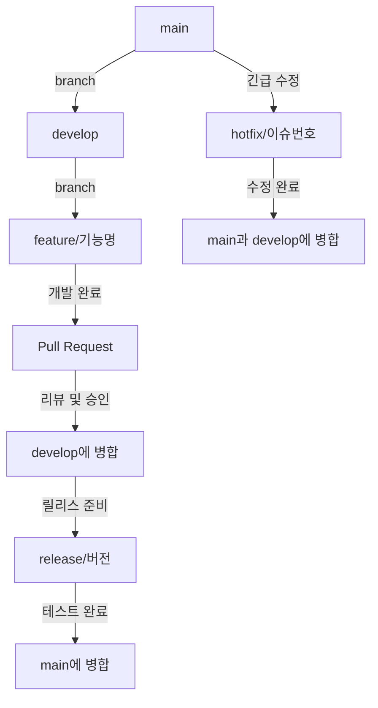
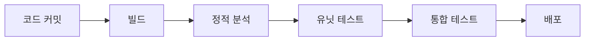

# 개발 워크플로우 가이드

## 개요

이 문서는 장비 관리 시스템의 개발 워크플로우에 대한 가이드라인을 제공합니다. 모든 팀원은 이 워크플로우를 따라 개발, 테스트, 배포 과정을 진행해야 합니다.

## 개발 환경 설정

1. [환경 설정 가이드](./environment-setup.md)에 따라 개발 환경을 구성합니다.
2. 필요한 도구와 의존성을 설치합니다.

## Git 워크플로우

### 브랜치 전략

장비 관리 시스템은 [GitHub Flow](https://guides.github.com/introduction/flow/) 기반의 브랜치 전략을 사용합니다.

1. **메인 브랜치**: `main` - 항상 배포 가능한 상태를 유지
2. **개발 브랜치**: `develop` - 개발 중인 기능이 통합되는 브랜치
3. **기능 브랜치**: `feature/기능명` - 새로운 기능 개발
4. **수정 브랜치**: `fix/이슈번호` - 버그 수정
5. **릴리스 브랜치**: `release/버전` - 릴리스 준비
6. **핫픽스 브랜치**: `hotfix/이슈번호` - 긴급 수정

### 일반적인 워크플로우



### 브랜치 명명 규칙

- **기능 브랜치**: `feature/user-management`, `feature/equipment-tracking`
- **수정 브랜치**: `fix/123-login-error`, `fix/ui-alignment`
- **릴리스 브랜치**: `release/1.0.0`, `release/2.1.0`
- **핫픽스 브랜치**: `hotfix/234-critical-security-issue`

### 커밋 메시지 규칙

커밋 메시지는 [Conventional Commits](https://www.conventionalcommits.org/) 방식을 따릅니다:

```
<타입>[범위]: <설명>

[본문]

[푸터]
```

#### 커밋 타입

- **feat**: 새로운 기능 추가
- **fix**: 버그 수정
- **docs**: 문서 수정
- **style**: 코드 포맷팅, 세미콜론 누락 등 (코드 변경 없음)
- **refactor**: 코드 리팩토링
- **test**: 테스트 코드 추가 또는 수정
- **chore**: 빌드 프로세스, 도구, 설정 변경 등

#### 예시

```
feat(equipment): 장비 대여 기능 구현

- 사용자가 장비를 대여할 수 있는 API 추가
- 대여 상태 관리 로직 구현
- 대여 이력 기록 기능 구현

Resolves #45
```

## 이슈 관리

### 이슈 유형

- **Feature**: 새로운 기능 요청
- **Bug**: 버그 보고
- **Enhancement**: 기존 기능 개선
- **Documentation**: 문서 작업
- **Technical Debt**: 기술적 부채 해결

### 이슈 템플릿

#### 기능 요청 템플릿

```markdown
## 기능 설명
[기능에 대한 간략한 설명]

## 필요성
[왜 이 기능이 필요한지 설명]

## 기대 결과
[기능 구현 후 예상되는 결과]

## 관련 설계 문서
[설계 문서 링크 또는 설명]

## 체크리스트
- [ ] 요구사항 분석
- [ ] 설계
- [ ] 구현
- [ ] 테스트
- [ ] 문서화
```

#### 버그 리포트 템플릿

```markdown
## 버그 설명
[버그에 대한 간략한 설명]

## 재현 방법
1. [첫 번째 단계]
2. [두 번째 단계]
3. [...]

## 예상 동작
[기대했던 동작]

## 실제 동작
[실제로 발생한 동작]

## 스크린샷
[가능한 경우 스크린샷 첨부]

## 환경 정보
- 브라우저: [예: Chrome 96.0]
- OS: [예: Windows 10]
- 앱 버전: [예: 1.2.0]

## 추가 정보
[관련된 추가 정보]
```

## 풀 리퀘스트(PR) 프로세스

### PR 생성

1. 작업 브랜치에서 모든 변경사항 커밋
2. 최신 `develop` 브랜치를 병합 또는 리베이스
3. GitHub에서 PR 생성
4. PR 설명에 관련 이슈 연결 및 변경사항 설명

### PR 템플릿

```markdown
## 변경사항 설명
[변경사항에 대한 간략한 설명]

## 관련 이슈
[관련 이슈 번호 (예: Fixes #123)]

## 변경 유형
- [ ] 새로운 기능
- [ ] 버그 수정
- [ ] 리팩토링
- [ ] 문서 업데이트
- [ ] 기타: [설명]

## 체크리스트
- [ ] 코드 스타일 가이드를 준수함
- [ ] 테스트 코드가 추가되었음
- [ ] 기존 테스트가 통과함
- [ ] 관련 문서가 업데이트되었음

## 스크린샷 (해당되는 경우)
[관련 스크린샷]

## 추가 정보
[PR에 대한 추가 정보]
```

### 코드 리뷰

1. 최소 1명 이상의 승인이 필요
2. 리뷰어는 코드 품질, 테스트, 문서화 확인
3. 모든 CI 검사 통과 필요
4. 리뷰 의견 반영 후 승인 시 병합 가능

### 병합 전략

- `develop` 브랜치로의 병합: "Squash and merge"
- `main` 브랜치로의 병합: "Create a merge commit"

## 개발 워크플로우

### 1. 환경 설정 및 이슈 할당

1. [개발 환경 설정](./environment-setup.md) 완료
2. GitHub 이슈 보드에서 작업할 이슈 선택
3. 자신에게 이슈 할당

### 2. 개발 시작

1. 최신 `develop` 브랜치에서 작업 브랜치 생성
```bash
git checkout develop
git pull
git checkout -b feature/이슈번호-기능명
```

2. 기능 구현 및 테스트 작성
3. 정기적으로 커밋 (작은 단위로 자주 커밋)
```bash
git add .
git commit -m "feat(모듈명): 구현 내용"
```

### 3. 개발 완료 후 PR 생성

1. 최신 `develop` 브랜치와 동기화
```bash
git checkout develop
git pull
git checkout feature/이슈번호-기능명
git merge develop
# 충돌 해결 후
git push origin feature/이슈번호-기능명
```

2. GitHub에서 PR 생성
3. PR 템플릿 작성 및 리뷰어 지정

### 4. 코드 리뷰 및 피드백 반영

1. 리뷰어의 피드백 확인
2. 필요한 변경사항 추가 커밋
3. 변경사항 푸시

### 5. 병합 및 이슈 종료

1. 승인된 PR을 `develop` 브랜치에 병합
2. 관련 이슈 종료
3. 작업 브랜치 삭제 (선택사항)

## 테스트 및 품질 보증

### 테스트 수준

1. **유닛 테스트**: 개별 함수, 컴포넌트 수준 테스트
2. **통합 테스트**: 여러 컴포넌트 간 상호작용 테스트
3. **E2E 테스트**: 전체 애플리케이션 흐름 테스트

### 품질 검사

1. **정적 코드 분석**: ESLint, TypeScript 타입 체크
2. **코드 포맷팅**: Prettier
3. **테스트 커버리지**: Jest 커버리지 리포트

### CI/CD 파이프라인



## 배포 프로세스

### 환경

1. **개발 환경(Development)**: 개발자 테스트용, `develop` 브랜치 기반 자동 배포
2. **스테이징 환경(Staging)**: QA 테스트용, `release` 브랜치 기반 자동 배포
3. **프로덕션 환경(Production)**: 실제 서비스용, `main` 브랜치 기반 수동 승인 후 배포

### 배포 단계

1. **개발 환경 배포**:
   - `develop` 브랜치에 병합 시 자동 배포
   - 개발자 기능 테스트

2. **스테이징 환경 배포**:
   - 릴리스 준비가 완료되면 `release` 브랜치 생성
   - 스테이징 환경에 자동 배포
   - QA 테스트 진행

3. **프로덕션 환경 배포**:
   - 스테이징 테스트 완료 후 `main` 브랜치로 PR 생성
   - 팀 리더 승인 후 병합
   - 프로덕션 환경에 배포
   - 배포 후 모니터링

### 릴리스 관리

1. **버전 관리**: [Semantic Versioning](https://semver.org/) 사용
   - 주 버전(Major): 호환되지 않는 API 변경
   - 부 버전(Minor): 이전 버전과 호환되는 기능 추가
   - 수 버전(Patch): 이전 버전과 호환되는 버그 수정

2. **릴리스 노트**: 각 릴리스마다 변경사항 문서화
   - 새로운 기능
   - 버그 수정
   - 변경사항
   - 알려진 이슈

3. **핫픽스**: 프로덕션 환경의 긴급 수정
   - `main` 브랜치에서 `hotfix` 브랜치 생성
   - 수정 후 `main`과 `develop` 브랜치에 병합

## 문제 해결 및 지원

### 일반적인 문제 해결

1. **개발 환경 문제**: [환경 설정 가이드](./environment-setup.md) 참조
2. **Git 관련 문제**: 팀 리드 또는 DevOps 담당자에게 문의
3. **코드 이슈**: GitHub 이슈 생성 또는 팀 채팅 사용

### 지원 채널

- **팀 채팅**: 일상적인 개발 논의
- **GitHub 이슈**: 버그 리포트, 기능 요청
- **문서**: 개발 가이드 및 API 문서
- **정기 미팅**: 주간 개발 회의 및 코드 리뷰 세션

## 개발 일정 및 마일스톤

### 스프린트 계획

1. **스프린트 길이**: 2주
2. **계획 미팅**: 스프린트 시작 시 이슈 할당 및 우선순위 설정
3. **일일 스탠드업**: 진행 상황 공유 (15분)
4. **회고 미팅**: 스프린트 종료 시 개선점 논의

### 주요 마일스톤

1. **알파 릴리스**: 기본 기능 구현
2. **베타 릴리스**: 핵심 기능 완성 및 초기 사용자 테스트
3. **MVP 릴리스**: 최소 기능 제품 출시
4. **정식 릴리스**: 전체 기능 구현 및 안정화

## 모니터링 및 피드백

### 애플리케이션 모니터링

- **에러 추적**: Sentry 또는 비슷한 도구 사용
- **성능 모니터링**: 응답 시간, 리소스 사용량 추적
- **사용자 행동 분석**: 사용 패턴 및 기능 활용도 분석

### 피드백 수집

- **사용자 피드백**: 인앱 피드백 기능
- **버그 리포트**: GitHub 이슈로 관리
- **사용성 테스트**: 주기적인 사용자 테스트 세션

## 결론

이 개발 워크플로우 가이드는 장비 관리 시스템의 효율적인 개발을 위한 기준을 제공합니다. 모든 팀원은 이 가이드라인을 따라 일관된 방식으로 작업하여 프로젝트의 품질과 일정을 유지해야 합니다.

추가 질문이나 제안이 있으면 팀 리드에게 문의하거나 GitHub 이슈를 통해 의견을 제시할 수 있습니다. 